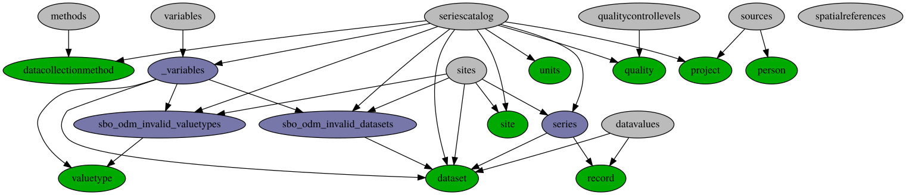

# Development

This chapter is intended to give an overview about the source code structure and the server stack used for ODMF.
Also it should let you understand the database schema, which is essential to the development since a ORM
framework is in use. So this chapter should be referred to, when developing the platform.
At the beginning there is a brief introduction to the design of the server system. After getting a overview of the
platform and its coherences, the [database](development.html#database-erm) is described briefly and the
[ORM mapping](development.html#database-orm-mapping) is explained in detail, so when developing you can make use of
the `odmf.db`-package. A [migration](#migration) part at the end explains the extension of the `ODMF` database
schema to fit the `ODM 1.1` schema.

In the following picture the server stack, consisting of the backend framework [cherrypy](https://cherrypy.org), which
connects the [postgres](https://postgres.org) database and renders with the help of templating engine
[genshi](https://genshi.edgewall.org/) the HTML content and a bit of [jquery](https://jquery.org).
Speaking of the server code, the database is accessed consistently via the ORM-mapping framework [sqlalchemy](https://www.sqlalchemy.org).
The Cherrypy server also exposes some methods as JSON exports for a rest-like use of data retrieval.

<!-- TODO very high level fmc -->

")

The development was done between 2013-today partially by a team of one or two developers. There are some acceptance
and ui tests, but no unit tests.

## Structure

* `tests` includes tests written to validate (1) the schwingbach server and (2) the HydroServerLite migration
* `bin` has scripts for interacting with the database or the HydroServerLite
* `src` contains the source files of the server
* `docs` encloses the sphinx documentation sources

### Components

")

The code base is divided in three main parts. **Server**, **automated import** and
**database communication**.

* Most of the **server** functionality is in the `webpage` module. It covers starting
  and stopping the server. Exposing of webpages and data endpoints.

  * Module `pages` contains all pages, unless they are `plot`, `site`, `upload`, `dataset` or `map`.
    In `webpage/lib.py` is utility code.
  * The `auth` module is based on the `bcrypt` hashing implementation.

* **automated import** functions reside in `dataimport` module.

* **database** and ORM code is in `db` the module.

Utility code for calibration, conf and markdown parsing are saved in the `tools` module.

## Data

This chapter describes the database schema, the differences and limitations of the ORM mapping and finally extending
the ODMF schema with SQL views to fullfill the
[ODM schema](https://github.com/CUAHSI/HydroServer/wiki/Observations-Data-Model).

### ODMF schema

In the relation `dataset` many foreign keys are stored, which point to other relations and additional metadata.
The most important are `site`, `valuetype` and `source`, of which the primary key of dataset consists.
The other foreign keys affiliation is straight forward.

The `record` relation keeps the essential data rows, that describe the measured data. Each row belongs to a `dataset` relation, which then extends the known data about it.

In the relation `person` all the user data is stored. Further the relation `job` contains a metadata to tasks, that are
assigned to a person. A element of relation `dataset` is assigned via `measured_by` to a `person` too.

### ORM mapping

The Python ORM framework [SQLalchemy](https://www.sqlalchemy.org) is used for handling data transactions for user
administration, field data import and metadata annotation.

#### Dataset

A dataset describes a valuetype for a specific site and time frame.

Distinction between `timeseries` and `transformed_timeseries`. Timeseries are realized data (concrete measured values)
and transformed timeseries are unrealized data, which are generated at runtime and derive from timeseries.

A dataset object has a so called back reference to records with a `lazy` join on the records, regarding the dataset.
[See sqlalchemy docs](http://docs.sqlalchemy.org/en/latest/orm/backref.html) on backref.

#### Valuetype
Valuetype holds a descripiton for a physical unit.

Valuetype holds a descripiton for a physical unit.

#### Job
A job has a title, description, due date and can be assigned to a person.
A job appears in the calendar view.

A job has a title, description, due date and can be assigned to a person.
A job appears in the calendar view.

#### DataCollectionMethod
TBD.

TBD.

#### Quality
TBD.`

TBD.`

#### Record
A record describes a dataset value for a specific timestamp.

A record describes a dataset value for a specific timestamp.

#### Site
A site describes the location, where data is to be measured.

A site describes the location, where data is to be measured.

#### Project
A project is the highest distinction in the database. Datasets are assinged to a project.

A project is the highest distinction in the database. Datasets are assinged to a project.

#### Person
A person is a user of the database.
There are [roles and permissions](wiki.html#access-levels).

### Extending ODMF schema

This section only describes the mapping of ODM to ODMF entities. ODM entities on their own,
are described in more detail in a dedicated
[design specification](https://www.cuahsi.org/uploads/pages/img/ODM1.1DesignSpecifications_.pdf).

The following picture consists of relations as nodes and access from relations to relations as edges.
It describes the schema mapping between the ODM (grey) and the ODMF (green) database relations.
Additionally there are helper relations (blue) when the conventional tables are not sufficient.

#### View `ODM.Methods`

Maps to the following ODMF entity [DataCollectionMethod](#datacollectionmethod).

#### View `ODM.QualityControlLevel`

Maps to the following ODMF entity [Quality](#quality).

#### View `ODM.Sites`

Maps to the following ODMF entities [Site](#site), [Dataset](#dataset) and uses from helper views
[series](#materialized-view-series), [sbo_odm_invalid_datasets](#special-view-sbo-odm-invalid-datasets)
and [sbo_odm_invalid_valuetypes](#special-view-sbo-odm-invalid-valuetypes).

#### View `ODM.Sources`

Maps to the following ODMF entities [Project](#project) and [Person](#project).

#### View `ODM.SpatialReferences`

Maps to no ODMF entities, since providing only one line of data from the Master Vocabulary.

#### View `ODM.Variables`

Maps to the ODMF helper view [\_variables](#materialized-view-variables).

#### Materialized view `_variables`

Maps to the following ODMF entities [Valuetype](#valuetype) and
[Dataset](#dataset). Also the helpers [sbo_odm_invalid_datasets](#special-view-sbo-odm-invalid-datasets)
and [sbo_odm_invalid_valuetypes](#special-view-sbo-odm-invalid-valuetypes) are used.
The name `_variables` is not part of ODM schema defintion, therefore is not queried by the HydroServer software.

#### Materialized view `ODM.Datavalues`

Maps to the following ODMF entities [Record](#record) and [Dataset](#dataset).

#### Materialized view `series`

Maps to the following ODMF entities [Record](#record) and [Dataset](#dataset).
The name `series` is not part of the ODM schema definition, therefore is not queried by the HydroServer software.

#### Materialized view `ODM.Seriescatalog`

Maps to the following ODMF entities: [Project](#project), [Quality](#quality), [Units](#units), [Site](#site), [Dataset](#dataset) and [DataCollectionMethod](#datacollectionmethod). Also to the following helpers
[series](#materialized-view-series), [\_variables](#materialized-view-variables),
[sbo_odm_invalid_datasets](#special-view-sbo-odm-invalid-datasets) and
[sbo_odm_invalid_valuetypes](#special-view-sbo-odm-invalid-valuetypes) are used.

The **Seriescatalog** is the big entity of the ODM schema, which stores all series data with the respective
meta information.

The `ODMF.dataset.id` is aggregated through `MIN` to `ODM.seriescatalog.seriesid`, to have only one id.
Also joining `ODMF.series` data to omit rows with `series.count < 0`.
To provide the `begindatetimeutc` and `enddatetimeutc` of `ODM.seriescatalog`, the attributes `start` and `end` of
`ODMF.dataset` are totalled up with `timezone` of `dataset` and the `pg_timezone_names.utc_offset`.
[See Postgresql docs](https://www.postgresql.org/docs/current/static/datatype-datetime.html#DATATYPE-TIMEZONES) on
timezones.

#### Special view `sbo_odm_invalid_datasets`

Uses the ODMF entity [Dataset](#dataset) with a set of invariant rules to produce only the result that is valid
in the ODM schema. After the invariant rules are applied, some rows can be ommited.

#### Special view `sbo_odm_invalid_valuetypes`

Uses the ODMF entity [Valuetype](#valuetype) with a set of invariant rules to produce only the result that is valid
in the ODM schema. After the invariant rules are applied, some rows can be ommited.

## Upload or Dataimport
Corresponds to the `/odmf/dataimport` directory.

This directory holds the files `__init__.py` and `base.py` which mainly provide some kind of abstract skeleton for the
data import. The other files go along with a descriptive filename, which is similar to names of the file including
class. For example `XlsImport` is for the import of `xls(x)` files.

Upload and data import is part of the *automated import* and is further explained in the
 [usage](usage.html#import-data) chapter.

[//]: # (TODO: Add UML diagram of LogImport etc.)

### Import process

#### Data upload

This is done by users of the software. This is usually not done automatically.

##### Upload type 1: Normal data

This is the most common way to upload. All other upload mechanism derives from this kind of upload protocol.

##### Upload Type 2: Manual measured data

TBD

##### Upload type 3: Log data

This is the most special way of uploading data. There are no real time series of data, rather
there are much more single data rows that are identified either with tuple of `dataset.valuetype`,
`dataset.site` and so on (Further information :ref:`see dataset <schema-dataset>`), or with
an explicit `dataset.id`, to determine one matching dataset where the data row is appended to.

### XlsImport
Corresponds to `odmf/dataimport/xls.py`

### configuration-files
The conf file upload is implemented in `dataimport.ImportDescription` and `dataimport.ImportColumn`.

**How to add a new configuration keyword:**

If the configparser module cannot parse a file, the `UnicodeDecodeError` is catched and a the estimated encoding
is returned to the user, as part of an error message.

## Migration

Differences of the database schemata of ODMF (Observatory Data Management Framework) and ODM (Observation Data Model).

### WaterOneFlow

To understand the details of the *How* on the concrete implementation of the WaterOneFlow interface for ODMF software system, using a dedicated server.

* What parts communicate how
* SQL Views as mapping from ODMF schema to ODM schema
* How to configure a HydroServerLite instance to fit your needs

#### Architecture overview

The system in use is a slightly modified version of the HydroServerLite, which can be found on
[Github](https://www.github.com/CUAHSI/HydroServerLite).
The application uses the PHP framework CodeIgniter and can work with several database backends, in the case of
the Schwingbach project it connects to a PostgresQL endpoint.

1. **Parsing client request:** The CodeIgniter middleware dispatches the client request and triggers the XML parsing
   process of the interface.

2. **Invoking helper methods with request parameters:** The parsed parameters from (1) are handed over to the respective
   methods of the endpoint, that are responsible for building the XML response.

3. **Building XML response:** The actual XML response is build, with usually calling more than one helper method.

The application code which defines the WaterOneFlow interface resides in `application/helpers/hydroservices_helper.php`. The methods are nested in two layers (1) `wof_METHODNAME` and `db_METHODNAME`, where METHODNAME substitutes a method name of the endpoint e.g. `GetSites` or `GetSiteInfo`.

Further documentation can be found on the official [CUAHSI homepage](https://www.cuahsi.org/data-models/legacy-tools/)
or just contact the CUAHSI staff.

#### SQL views

Mainly SQL views are used to provide the data of the ODMF schema in the form of the ODM 1.1 schema.

* `methods`
* `qualitycontrollevel`
* `sites`
* `sources`
* `spatialreferences`
* `variables`

Additional materialized views are used to maximize performance for views producing larger result sets.
List of materialized views:

* `_variables`
* `datavalues`
* `series`
* `seriescatalog`

List of special views:

* `sbo_odm_invalid_datasets`
* `sbo_odm_invalid_valuetypes`

A more detailed description of the views can be found in [Extending ODMF schema](#extending-odmf-schema).

### Schema mapping validity

It's important to check on the schema mapping validity, since the Schwingbach database schema is extended through
different database views to fit the CUAHSI ODM schema. The CUAHSI schema accessed via the HydroServerLite instance.

The postgres helper view `ODMF.sbo_odm_invalid_datasets` and `ODMF.sbo_odm_invalid_valuetypes` define the invariants
of the schema mapping. When selected they return all `ODMF.dataset`s and `ODMF.valuetype`s which will break the ODM
schema constraints.

Items of `ODMF.dataset` are omitted when the following rules apply on them:

* `dataset.start = dataset.end` (`odmf.dataset` attributes start and end, can be identical in the rare case of a size of just one record.)
* `dataset.access = 0`, data is only for internal use
* `dataset.project is NULL`

Items of `ODMF.valuetype` are omitted, when one of the following rules apply on them:

* `valuetype.cv_unit is NULL` or `valuetype.cv_variable_name is ''`, therefore no mapping to items of the controlled vocabulary can be done.
* `valuetype.id in (30)`, when the id is in list of integers, which to be omitted.

The view `seriescatalog` is pointer where all series are published. So to prevent the ODM schema views on the ODMF schema tables to break, the view `seriescatalog` filters based on `sbo_odm_invalid_datasets` helper view all invalid datasets.

### Daily jobs

The creation of the transformed timeseries is done via the `update_transformedvalues.py` in
the `odmf.migration_util.cuahsi` namespace.
The script fetches all datasets that are transformed_timeseries and creates the data record rows.
This rows would usually not reside as realized data in the database. But this is done to improve
the performance of the WaterOneFlow API, when requesting data, which is a transformed_timeseries
in terms of the ODMF schema.

Different phases described:

1. Deletes all old realized transformed_timeseries records

2. Fetches all tranformed_timeseries datsets and then records and caches them in python data structure

3. Applies transformation to the values and persists tranformed record value in the `ODMF.record` table.

The realized records cannot be queried by the ODMF software system. They are only visible to the WOF
API, because the ORM layer only accesses records with `dataset.type` that are non-`transformed_timeseries`.

### Configuration

An easy way of configuration is not possible at the moment, because the deployment of the HydroServerLite
is done via static SQL scripts. To configure the system, this scripts can be altered, but this is somehow
impractical, when done more than once.
