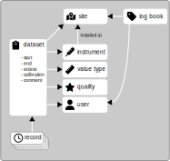

# !fa-clipboard Datasets

Datasets are the core feature of the structured database in ODMF. A dataset is a collection of metadata:

- [!fa-ruler What is measured?](valuetype) 
- !fa-user Who did it? Person 
- [!fa-map-location Where is the data located?](site), Level  
- [!fa-thermometer-half How is it measured?](instrument) 
- !fa-star What is the data quality? 
- !fa-key Who can use the data? 
- !fa-clock When?

In most cases, datasets are timeseries with their own records. You can create transformed timeseries, which uses
a measured timeseries, applies some mathematical equation and returns the transformed data. Eg. you have a timeseries
of groundwater depth below ground, you can create a transformed dataset with groundwater head above sea level.

And you can use datasets to annotate files, then you enter every information in the dataset, but you will never import 
records for this dataset.

To record qualitative data, like event descriptions without numeric data or with a complex data structure, you are
going to add [log-entries](log) to sites

## Properties

[Valuetype](valuetype), [location](site) and [instrument/ data source](instrument) are described on their subpages.
The level is a vertical offset of the given location, eg. if you have a soil moisture sensor profile in 10, 30 and 60 cm
depth, tag the datasets with the levels in m below ground as -0.1, -0.3 and -0.6 respectively.

Please indicate the data quality as one of the possible values: 0: raw, 1: formal checked, 2: quality checked, 
3: calibrated, 4: derived value

The start and end time is adjusted when adding records.

The access level is used to prevent users of the database to see your data, if they are from another project or
do not have enough privileges to see the data: 0: public dataset, 1: only known users and project members, 
2: only users with editing privileges, 3: only employees and data managers, 4: only administrators 
ODMF is not a repository - data in the database is not licenced to be used in any publication. 
You must always contact the data owner prior to usage in a publication. It is best practice to publish data 
in a repository like [zenodo.org](https://zenodo.org) and let your colleagues cite that data with a doi.

## How many datasets do I need?

This is heavily depending on your use case. See [examples](dataset-examples)

## How do I create new datasets?

For adding one or few datasets, click the "new dataset" button on the !fa-clipboard page and enter the metadata.
If you have many similar datasets, for example when the same measurement is taken at multiple sites, you can create
an excel list of dataset info and import them. Export a dataset list to get a template. Delete the "id" column 
as the ids will be given automatically. All other columns must be maintained and filled with default values.
You can get more information about the format after clicking the "import datasets" button.
