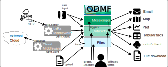

{width=750px}
# ODMF - Observatory Data Management Framework

The ODMF system is a web app and has three main functions:

1. Share and annotate field data by **uploading** files using the help:file-manager
2. Make structured timeseries findable, accessible, interoperable and researchable by **importing** data in help:datasets. 
   The data can be presented in a help:plot
3. Facilitate communication about field work coordination with help:messenger and jobs

{width=750px}

## help:file-manager !fa-file

The help:file-manager is a simple platform to share files in the user group, access is ordered by project
membership. Users **upload** files to the help:file-manager. If the data should become findable, you can **import** 
the data in the files into help:datasets as a second step. 

## help:datasets !fa-clipboard 

The structured database is mainly targeted on providing timeseries data at
geographical locations. This data is organized in help:datasets and you can find the data on the [!fa-map map](/map).

Access to files and datasets is organized for users and projects

